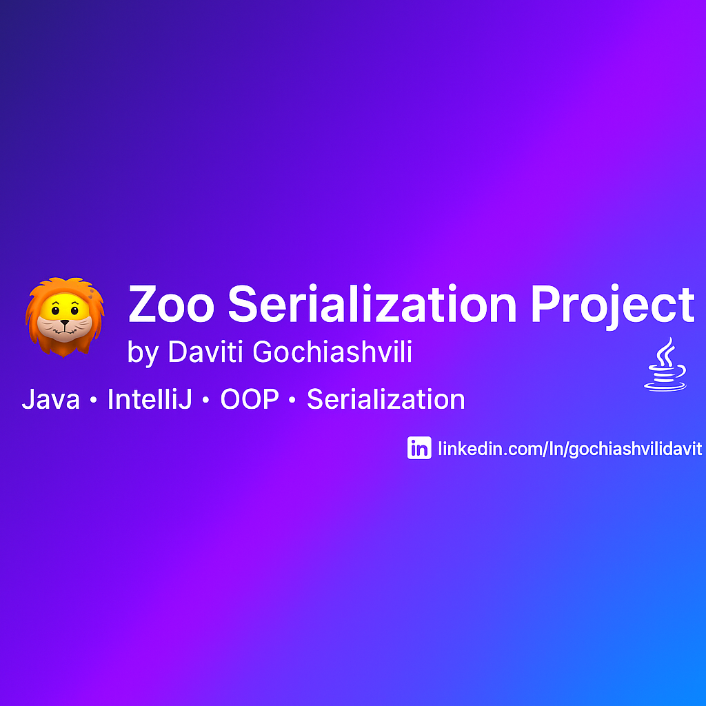

# 🦁 Zoo Serialization Project

A Java console-based application developed as part of the **Coursera Programming with Java** course.  
This project demonstrates **Object Serialization and Deserialization** using Java I/O streams, featuring multiple animal classes and their specific behaviors.

---

## 🧠 Project Overview

This project simulates a virtual zoo where each animal has its own unique attributes and actions.  
It highlights how to save and restore the state of Java objects using serialization.

---

## 📂 Class Structure

| Class | Description |
|-------|--------------|
| `Animal.java` | Base class containing common fields such as age, height, and weight. |
| `Tiger.java` | Represents a tiger with properties like number of stripes, speed, and sound level. |
| `Penguin.java` | Represents a penguin that can swim and walk, with adjustable speeds. |
| `Dolphin.java` | Represents a dolphin with attributes like color and swimming speed. |
| `Swim.java` | Interface defining swimming behavior. |
| `Walk.java` | Interface defining walking behavior. |
| `Eat.java` | Interface defining eating behavior. |
| `Main.java` | Entry point of the program; handles serialization and deserialization logic. |

---

## ⚙️ Key Features

✅ Object-Oriented Programming (OOP)  
✅ Serialization & Deserialization with `ObjectOutputStream` and `ObjectInputStream`  
✅ Inheritance and Interface Implementation  
✅ Polymorphism and method overriding  
✅ File handling with exception management  

---

## 🧩 Example Output
Zoo Menu:

Display properties

Display movement

Display eating

Exit

Penguin is swimming...
Tiger is roaring...
Dolphin is swimming fast...

---

## 🔍 Quick Summary

**Zoo Serialization Project** is a Java OOP and file-handling project demonstrating  
object serialization, interfaces, and polymorphism.  

✅ Technologies: Java, IntelliJ IDEA, Object Streams  
✅ Concepts: Inheritance, Interfaces, Serialization  
✅ Goal: Show clean and modular Java development with real file persistence  

---

## 👨‍💻 Author

**Daviti Gochiashvili**  
🎓 M.S. in Web Application Development – Touro University, New York  
💼 Java & Web Developer | AI Enthusiast  
📧 [gochiashvilidavit@gmail.com](mailto:gochiashvilidavit@gmail.com)  
🌐 [LinkedIn](https://www.linkedin.com/in/gochiashvilidavit) | [GitHub](https://github.com/gochiashvilidavit)

---

📂 **Full Code:** [GitHub Repository](https://github.com/gochiashvilidavit/zoo-upgrade)

